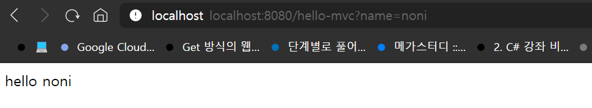

# spingboot
@ojc1234
>spring 부트를 사용하여 만들어 보았어요
>> 사용하는 방법 java와 gradle이 로컬에 설치되어있어야해요
>> newspring 폴더에서 gradle build를 치고 
>> gradle bootrun을 치면 방화벽이 뜰텐데 방화벽 허용하고 localhost:8080에 접속하면 mainpage를 볼수있어요
---

사진처럼 접속하면 링크를 통해 html을 바꿀수 있어요
(localhost:8080/hello-mvc?name=noni)
---
*본 프로젝트는 교육에 목적으로만 사용하였고 라이센스에 대해서는 개발자가 책임지지 않습니다.
